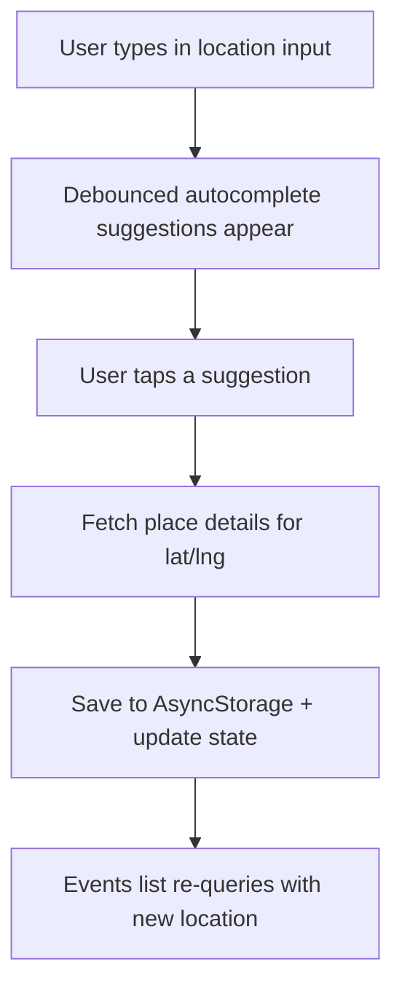
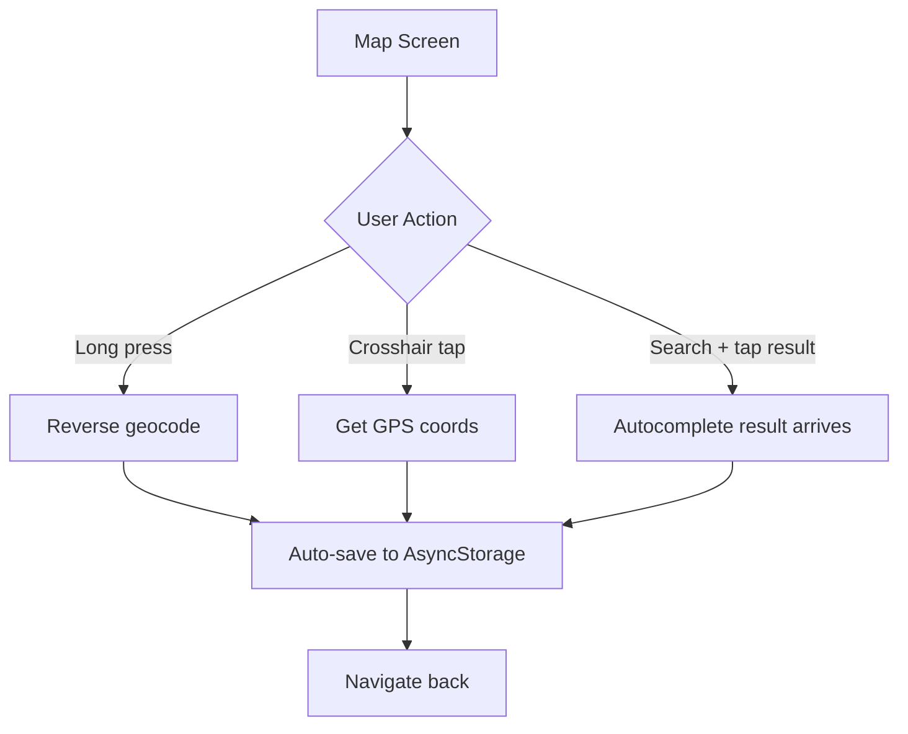

# Events Location UX Improvements

## Current Behavior

The events header location button opens a full map screen where users must:

1. Long-press to place a pin, then tap "Set Location"
2. Use the crosshair to get current location, then tap "Set Location"
3. Search an address (goes to autocomplete), which navigates back to the map, then tap "Set Location"

The distance filter in event filters is UI-only -- it is never sent to the backend and has no effect on query results.

## Changes

### 1. Events header: Inline autocomplete (no navigation)

**Files:**

- `[apps/native/src/components/app/events/events-header.tsx](apps/native/src/components/app/events/events-header.tsx)`
- `[apps/native/src/app/(app)/(tabs)/events.tsx](apps/native/src/app/(app)`/(tabs)/events.tsx)

Replace the location button with the existing `LocationAutocompleteInput` component used inline in the header. The input shows the current location name as placeholder text.

- Remove `handleLocationPress` and the navigation to the map screen
- Render `LocationAutocompleteInput` in place of the location button
- On place selection (`onSelect`): call `api.table.places.details` to get coordinates, save to AsyncStorage under `EVENT_SEARCH_LOCATION_STORAGE_KEY`, and call a new `onLocationChange` callback prop so the parent (`events.tsx`) can update `searchLocation` state immediately without needing to re-read from AsyncStorage
- Add a clear/reset option (e.g., "X" button or "Everywhere" option) to remove the location filter
- The `events.tsx` screen manages `searchLocation` state and passes it down; on change, it persists to AsyncStorage and the query updates reactively

### 2. Map screen: Remove "Set Location" button, auto-set on interactions

**File:** `[apps/native/src/app/(app)/location-search/index.tsx](<apps/native/src/app/(app)`/location-search/index.tsx>)

- **Remove the "Set Location" button** from the bottom action bar
- **Long-press auto-sets:** After `handleMapLongPress` gets the reverse-geocoded address, automatically call `handleSetLocation` (save to AsyncStorage and navigate back)
- **Crosshair auto-sets:** After `handleCurrentLocation` gets the current position and reverse-geocoded address, automatically call `handleSetLocation`
- **Autocomplete result auto-sets:** When `selectedLat`/`selectedLng` arrive from the autocomplete screen (via params), automatically save and navigate back after a brief pause to show the pin

### 4. Distance filter: Implement backend support

**Backend file:** `[packages/backend/convex/table/events.ts](packages/backend/convex/table/events.ts)`

- Add optional args to `getEvents`: `searchLatitude: v.optional(v.number())`, `searchLongitude: v.optional(v.number())`, `maxDistanceMeters: v.optional(v.number())`
- Reuse the Haversine formula from `[packages/backend/convex/table/geospatial.ts](packages/backend/convex/table/geospatial.ts)` (extract to a shared utility or duplicate the small function)
- After existing filters, if `searchLatitude`, `searchLongitude`, and `maxDistanceMeters` are all provided, filter events that have `latitude`/`longitude` to only those within the distance. Events without coordinates are excluded when distance filter is active.

**Frontend file:** `[apps/native/src/app/(app)/(tabs)/events.tsx](<apps/native/src/app/(app)`/(tabs)/events.tsx>)

- Parse the distance filter string (e.g., "5 miles", "10 km") into meters
- Pass `searchLatitude`, `searchLongitude` (from `searchLocation`), and `maxDistanceMeters` to the `getEvents` query when both a distance filter and a search location are set
- When distance is "Any Distance", do not pass the distance args

**Constants file:** `[apps/native/src/constants/events.ts](apps/native/src/constants/events.ts)` (no changes needed -- distance values will be parsed at runtime)

### Flow Diagrams

**New events header location flow (all inline, no navigation):**

**New map screen flow (used from non-events contexts):**

